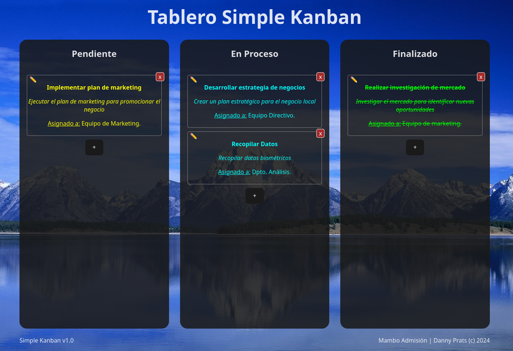

# Simple Kanban App



## Descripción del Proyecto
Aplicación web responsive que funciona com un Kanban básico. El principal objetivo de la aplicación es permitir a los usuarios agregar tareas a un tablero, cambiar el estado de las tareas entre tres opciones: Pendiente, En Proceso y Finalizado, y proporcionar información básica sobre cada tarea.

Live Preview: 

## Especificaciones Funcionales
1. **Tablero Kanban:**
   - El tablero tiene tres columnas: Pendiente, En Proceso y Finalizado.
   - Las tareas se representan visualmente en la columna correspondiente al estado actual.
2. **Agregar Tareas:**
   - Los usuarios pueden agregar nuevas tareas al tablero.
   - Al agregar una tarea, se deben recopilar tres datos principales: nombre de la tarea, descripción de la tarea y a quién está asignada.
3. **Cambiar Estado de Tareas:**
   - Los usuarios pueden cambiar el estado de una tarea de Pendiente a En Proceso y de En Proceso a Finalizado.
   - La interfaz proporciona una manera intuitiva de realizar estos cambios de estado.
4. **Visualización de Tareas:**
   - Cada tarea en el tablero muestra información clave, como nombre, descripción y persona asignada.
   - La visualización de las tareas es clara y fácil de entender.

## Especificaciones Técnicas
1. **Tecnologías:**
   - Frontend: React / tested with node 20.3.1
   - Backend: Django / tested with python 3.10.6
2. **Responsive Design:**
   - La aplicación es completamente responsive para garantizar una experiencia de usuario consistente en diferentes dispositivos (computadoras de escritorio, tabletas, teléfonos).
3. **Almacenamiento de Datos:**
   - Almacenamiento local con SQLite.
4. **Seguridad:**
   - Implementa medidas básicas de seguridad para proteger los datos del usuario, especialmente si se almacenan en algún tipo de base de datos.
5. **Interfaz de Usuario Intuitiva:**
   - El Diseño de la interfaz de usuario es intuitiva y fácil de usar para que los usuarios puedan interactuar sin dificultad.

## Instalación y Uso
Para instalar y utilizar la aplicación, sigue estos pasos:

1. Clona este repositorio en tu máquina local.
```sh
git clone https://github.com/dannycoin/simple-kanban.git
```
2. Navega a la carpeta del proyecto.
```sh
cd simple-kanban
```
3. Instala las dependencias del frontend utilizando el siguiente comando:
```sh
npm install
```
4. Instala las dependencias del backend utilizando el siguiente comando:
```sh
pip install -r requirements.txt
```
5. Ejecuta las migraciones en la base de datos (solo en caso de una nueva DB):
```sh
python manage.py migrate
python manage.py makemigrations
python manage.py migrate
python manage.py seeds
```
6. Inicia el servidor de desarrollo del backend con el siguiente comando:
```sh
python manage.py runserver
```
7. Inicia el servidor de desarrollo del frontend con el siguiente comando:
```sh
npm run dev
```
7. Abre tu navegador web y navega a `http://localhost:5173` para ver la aplicación en acción.

¡Disfruta utilizando la aplicación Simple Kanban!

## Credits
by Danny Prats © 2024
email: dannyprats@gmail.com